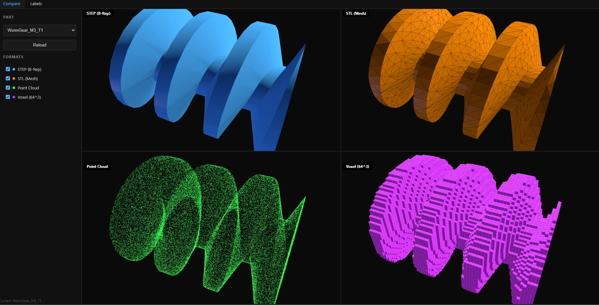
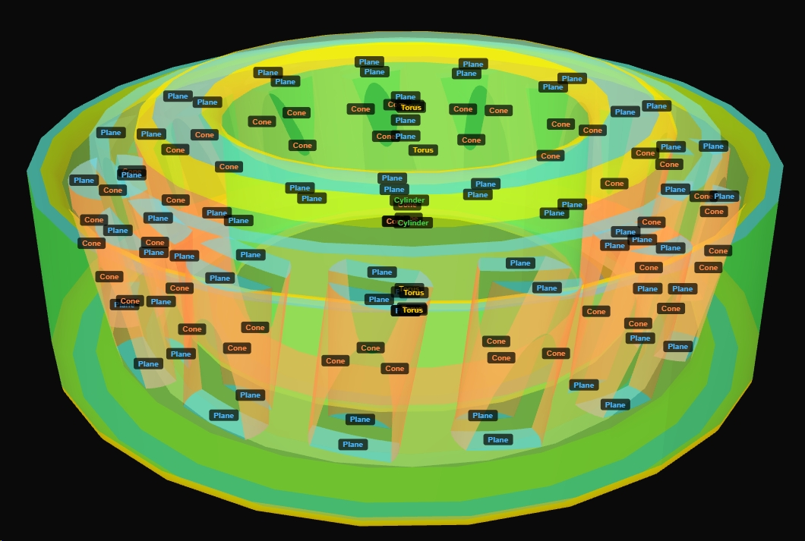

# OCCT-MechBench

ISO standard mechanical parts dataset. 2,372 STEP B-Rep solids, 5 formats, built for AI training. All dimensions strictly comply with ISO standard length series.

## Parts Catalog

| Name | Standard | Count |
|------|----------|-------|
| HexagonNut | ISO 4032/4033/4035 | 67 |
| HexHeadBolt | ISO 4014/4017 | 664 |
| SocketHeadCapScrew | ISO 4762 | 223 |
| CountersunkScrew | ISO 14581/10642/2009/14582/7046 | 563 |
| PanHeadScrew | ISO 14583/1580 | 158 |
| SetScrew | ISO 4026 | 196 |
| PlainWasher | ISO 7089/7091/7093/7094 | 75 |
| ChamferedWasher | ISO 7090 | 52 |
| DeepGrooveBallBearing | SKT | 31 |
| CappedDeepGrooveBallBearing | SKT | 25 |
| AngularContactBallBearing | SKT | 9 |
| CylindricalRollerBearing | SKT | 9 |
| TaperedRollerBearing | SKT | 26 |
| SpurGear | ISO 54 | 130 |
| BevelGear | ISO 54 | 42 |
| CrossedHelicalGear | ISO 54 | 28 |
| RackGear | ISO 54 | 21 |
| RingGear | ISO 54 | 35 |
| WormGear | ISO 54 | 18 |
| | **Total** | **2,372** |

Bolt/screw lengths strictly constrained within ISO standard range (diameter-length upper bound validation).

## Data Formats

| Format | Description | Count | Parameters |
|--------|-------------|-------|------------|
| STEP (.step) | B-Rep solids, exact NURBS | 2,372 | CadQuery generated |
| STL (.stl) | Triangle mesh | 2,372 | CadQuery tessellation |
| Point Cloud (.ply) | Uniform surface sampling | 2,372 | 65,536 pts |
| Voxel (.npy) | 64^3 binary voxel grid | 2,372 | OCC solid classification |
| Multi-view (.png) | 24-angle renders | 56,928 | 300x300, black background |

## Generation

Environment: Python 3.11, CadQuery, pythonocc-core, trimesh, numpy, scipy

```bash
conda activate occ

python generate/generate_step.py      # STEP — CadQuery + cq_warehouse + cq_gears
python generate/step_to_stl_cpu.py    # STEP -> STL
python generate/stl_to_ply_cpu.py     # STL -> PLY (binary, 65536 pts)
python generate/step_to_npy_cpu.py    # STEP -> NPY (OCC solid classifier)
python generate/step_to_png_cpu.py    # PNG 24 views
```

All scripts use `cpu_count() - 1` multiprocessing.

### Voxel Generation

Directly from STEP B-Rep solids without STL intermediate:

1. `STEPControl_Reader` loads STEP
2. `BRepClass3d_SolidClassifier` classifies each grid point
3. Zero approximation, zero ray casting, zero precision issues

## Web Viewer

`http://localhost:8005` — Flask + Three.js, two tabs.




- **Compare** — Multi-format side-by-side (STEP/STL/point cloud/voxel), dynamic layout, synchronized rotation
- **Labels** — Face-type annotations, color-coded by geometry type (Plane=blue, Cylinder=green, Cone=orange), with legend and labels

**Rendering per format:**

| Format | Method |
|--------|--------|
| STEP | BRepMesh tessellation, Phong smooth, blue |
| STL | trimesh, flat shading + wireframe, orange |
| Point Cloud | 65,536 points, green |
| Voxel | 64^3 solid, Lambert + wireframe, purple |

**Start:**
```bash
conda activate occ
python viewer/web_server.py
# Open http://localhost:8005
```

## Data Quality

- Unified coordinate system, CadQuery generated
- Dimensions strictly compliant with ISO standards
- Voxels: zero approximation (OCC solid classification)

## Citation

```bibtex
@dataset{OCCT-MechBench2026,
  author = {haiyichen001},
  title = {OCCT-MechBench: ISO Standard Mechanical Parts Dataset for AI Training},
  year = {2026},
  url = {https://github.com/haiyichen001/OCCT-MechBench}
}
```

## License

MIT
